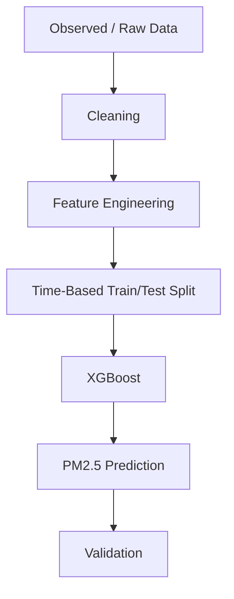

# AERIS
## Urban Environmental Intelligence & Digital Twin

AERIS is an AI/ML and GIS-powered environmental decision-support prototype that connects air-quality observations, weather data, traffic patterns, and spatial/environmental context into a single urban digital-twin workflow. It moves beyond passive pollution monitoring — enabling users to forecast PM2.5 concentrations, understand model-estimated pollution drivers, and evaluate the modelled impact of intervention scenarios across urban zones.

> **HackMatrix 5.0 · ENR-01 · Round-1 Working Prototype**

---

## 1. Problem Statement

Urban air-quality monitoring systems can display current pollution conditions, but monitoring alone offers limited support for:

- **Forecasting** pollution levels over upcoming hours
- **Identifying spatial hotspots** where pollution concentrations are highest
- **Understanding model-estimated environmental drivers** that contribute to elevated pollution
- **Evaluating possible interventions** — such as traffic reduction — and their modelled effect on air quality

The ENR-01 problem statement asks teams to bridge this gap by connecting four interrelated domains:

| Domain | Role |
|---|---|
| Air Quality | PM2.5 / PM10 observations and forecasts |
| Weather / Meteorology | Temperature, humidity, wind, rainfall |
| Traffic | Vehicle flow and congestion patterns |
| Spatial / Environmental Context | Spatial zones, location context, and environmental context |

AERIS addresses this by building an integrated observe → forecast → attribute → simulate workflow rather than treating each domain in isolation.

---

## 2. Proposed Solution

AERIS is an AI/ML + GIS environmental decision-support prototype that allows users to:

- **Inspect observed PM2.5** — view current environmental state across Pune zones
- **Explore urban pollution hotspots** — identify spatial concentrations on an interactive map
- **View a PM2.5 forecast** — 24-hour outlook powered by XGBoost
- **Inspect model-estimated drivers** — SHAP-based feature attribution for pollution contributors
- **Run a traffic-reduction scenario** — simulate an intervention and generate modelled results
- **Compare baseline vs modelled PM2.5** — evaluate the estimated impact of the intervention

**Core idea:**

> Monitoring → Forecasting → Intervention-oriented analysis

---

## 3. Core Workflow


| Stage | Description |
|---|---|
| **Observe** | Ingest and display current air-quality, weather, and traffic data |
| **Forecast** | Generate a 24-hour PM2.5 prediction using XGBoost |
| **Attribute** | Identify model-estimated drivers via SHAP feature attribution |
| **Simulate** | Run an intervention scenario (e.g., traffic reduction) |
| **Compare** | Evaluate baseline vs modelled PM2.5 outcome |
| **Decision** | Support environmental planning with data-driven insights |

---

## 4. Round-1 Working Scope

Round 1 focuses on approximately **30–40%** of the proposed final ENR-01 solution through one working and demonstrable vertical slice.

```
Observed Environmental Data
          ↓
       Urban Map
          ↓
    PM2.5 Forecast
          ↓
Historical Validation
          ↓
   Hotspot Analysis
          ↓
Model-Estimated Drivers
          ↓
 Traffic Intervention
          ↓
Baseline vs Modelled PM2.5
```

### ✅ Implemented / Demonstrated

- Observed PM2.5 state
- 3 Pune zones with zone selection and details
- Interactive urban map with hotspot visualization
- 24-hour PM2.5 forecast
- Observed vs modelled visualization
- Historical validation (MAE, RMSE, R²)
- SHAP / model-estimated driver analysis
- One traffic intervention scenario
- Baseline vs modelled result comparison

### 🔲 Planned / Future

- Additional intervention types (industrial, combined)
- Broader source categories
- Larger spatial coverage and more zones
- Stronger uncertainty analysis and modelling
- Optimization capabilities
- Deeper digital-twin simulation

---

## 5. Product Modules

| Module | Purpose |
|---|---|
| **Overview** | Current environmental state across zones |
| **Forecast** | 24-hour PM2.5 outlook |
| **Hotspots** | Spatial pollution concentration mapping |
| **Drivers** | Model-estimated feature contributions (SHAP) |
| **Scenarios** | Traffic intervention simulation |
| **Validation** | Historical model evaluation |

---

## 6. Key Innovation

The innovation in AERIS is not any single library or algorithm — it is the **integrated decision workflow** that chains observation, forecasting, attribution, simulation, and comparison into one coherent pipeline.

```
OBSERVE
   ↓
FORECAST
   ↓
ATTRIBUTE
   ↓
SIMULATE
   ↓
COMPARE
   ↓
DECISION
```

This moves the user experience from **passive pollution monitoring** to **intervention-oriented environmental intelligence** — where the system helps answer not just *"what is the pollution level?"* but *"what might happen if we intervene?"*

---

## 7. System Architecture

```mermaid
flowchart LR
    subgraph S1["1. DATA SOURCES"]
        direction TB
        DS_AQ["Air Quality"]
        DS_WX["Weather"]
        DS_TR["Traffic"]
        DS_SP["Spatial Data"]
    end

    subgraph S2["2. DATA PROCESSING"]
        direction TB
        DP_PY["Python"]
        DP_PD["Pandas"]
        DP_NP["NumPy"]
        DP_FE["Feature Engineering"]
    end

    subgraph S3["3. AI / ML CORE"]
        direction TB
        ML_FC["PM2.5 Forecasting"]
        ML_SH["SHAP Explainability"]
        ML_SC["Scenario Modelling"]
    end

    subgraph S4["4. BACKEND SERVICES"]
        direction TB
        BE_API["Python + FastAPI"]
        BE_REST["REST APIs"]
        BE_VAL["Validation & Schemas"]
    end

    subgraph S5["5. DATA & SPATIAL LAYER"]
        direction TB
        DB_PG["PostgreSQL"]
        DB_GIS["PostGIS"]
        DB_HOT["Spatial Hotspots"]
    end

    subgraph S6["6. AERIS DASHBOARD"]
        direction TB
        FE_RT["React + TypeScript"]
        FE_MAP["MapLibre"]
        FE_CHT["Recharts"]
        FE_CSS["Tailwind CSS"]
    end

    S1 --> S2
    S2 --> S3
    S3 --> S4
    S4 --> S5
    S4 --> S6
    S5 --> S6
```



Architecture flow: Data Sources → Data Processing → AI/ML Core → Backend Services → Data & Spatial Layer → AERIS Dashboard

---

## 8. Technology Stack

> The technology stack below represents the **complete proposed AERIS architecture**, not only the currently implemented Round-1 prototype.

### Frontend
`React` · `TypeScript` · `Vite` · `MapLibre GL JS` · `Recharts` · `Tailwind CSS`

- Interactive environmental intelligence dashboard
- GIS-based urban map visualization
- Forecast, hotspot, driver, validation, and scenario visualizations

### Backend Services
`Python` · `FastAPI`

Supporting components: REST APIs · Validation & Schemas

- Serve environmental and zone data
- Connect ML outputs with the frontend
- Handle forecast and scenario requests

### AI / ML Core
`XGBoost` · `SHAP`

Core capabilities: PM2.5 Forecasting · SHAP Explainability · Scenario Modelling

- Forecast PM2.5 concentrations
- Explain model predictions through feature attribution
- Support intervention-oriented scenario simulation

### Data Processing
`Python` · `Pandas` · `NumPy`

Supporting capability: Feature Engineering

- Clean and transform environmental datasets
- Prepare temporal, meteorological, and traffic-related features
- Generate ML-ready inputs

### Data & Spatial Layer
`PostgreSQL` · `PostGIS`

Supporting capability: Spatial Hotspots

- Store environmental and geospatial data
- Support zone-based spatial analysis
- Represent pollution hotspots geographically

### Development & Collaboration
`Git` · `GitHub` · `Docker`

---

| Technology | Purpose |
|---|---|
| React + TypeScript | Interactive dashboard |
| Tailwind CSS | Utility-first styling |
| MapLibre GL JS | GIS map visualization |
| Recharts | Data charts and visualizations |
| FastAPI | REST API layer |
| XGBoost | PM2.5 forecasting model |
| SHAP | Model feature attribution |
| Pandas / NumPy | Data processing and feature engineering |
| PostgreSQL / PostGIS | Spatial data storage |
| Git / GitHub / Docker | Version control, collaboration, containerization |

---

## 9. Data & ML Methodology



**Target variable:** PM2.5

**Feature categories:**

| Category | Examples |
|---|---|
| Historical PM2.5 | Lag values, rolling statistics |
| Particulate | PM10 where available |
| Meteorological | Temperature, humidity, wind, rainfall |
| Traffic | Traffic-related variables |
| Temporal | Hour, day-of-week, seasonal encodings |

**Validation metrics:**

- **MAE** — Mean Absolute Error
- **RMSE** — Root Mean Squared Error
- **R²** — Coefficient of Determination

> Validation uses a time-aware train/test split to prevent data leakage.

---

## 10. Model-Estimated Drivers

SHAP (SHapley Additive exPlanations) is used to estimate the contribution of each feature to the model's PM2.5 predictions. Driver categories include:

| Driver Category | Examples |
|---|---|
| Traffic | Vehicle flow, congestion indicators |
| Meteorology | Wind speed, temperature, humidity |
| Spatial / Environmental Context | Spatial and environmental context features |

> **Important:** Model attribution indicates feature contribution to the model output and should not be interpreted as direct causal measurement. These are model-estimated drivers, not definitive pollution causes.

---

## 11. Digital Twin Scenario

The Round-1 prototype demonstrates a single traffic-reduction intervention scenario.

**Workflow:**

```
Select Zone → Set Traffic Reduction → Run Scenario → Generate Modelled Result → Compare Baseline vs Modelled
```

**Conceptual UI representation:**

```
┌─────────────────────────────────────────────┐
│                                             │
│   BASELINE              MODELLED            │
│   118 µg/m³             96 µg/m³            │
│                                             │
│                 ↓                            │
│              −18.6%                          │
│                                             │
└─────────────────────────────────────────────┘
```

> **Note:** The values shown above are an illustrative UI representation. Actual numbers are generated at runtime based on zone selection and reduction parameters.

The scenario does not claim guaranteed pollution reduction — it presents the **modelled estimate** based on the trained XGBoost model with modified traffic inputs.

---

## 12. Observed vs Modelled

AERIS maintains a clear distinction between two data types throughout the application:

| Type | Definition |
|---|---|
| **Observed** | Measured or source-provided environmental information |
| **Modelled** | Forecasted or scenario-estimated information |

This distinction is preserved across:

- Charts and time-series visualizations
- Metrics and summary statistics
- Map overlays
- Scenario simulation results
- All labels and legends

---

## 13. Historical Validation

The model is evaluated against historical observed data using a time-aware validation strategy:

- **Observed vs modelled PM2.5** plotted over the test period
- **MAE, RMSE, R²** computed on held-out test data
- Time-based split ensures no future information leaks into training

---

## 14. API Layer

| Method | Endpoint | Purpose |
|---|---|---|
| `GET` | `/api/health` | Health check |
| `GET` | `/api/observations` | Observed environmental data |
| `GET` | `/api/zones` | Zone information |
| `GET` | `/api/forecast` | PM2.5 forecast |
| `POST` | `/api/scenario/simulate` | Scenario simulation |

**Swagger documentation:** `/docs`

---

## 15. Repository Structure

```
aeris/
├── frontend/          # React + TypeScript dashboard
├── backend/           # FastAPI application
│   └── app/
│       ├── api/       # Route handlers
│       ├── services/  # Business logic
│       ├── schemas/   # Pydantic models
│       └── repositories/
├── ml/                # XGBoost training, evaluation, SHAP
│   ├── src/           # ML source code
│   ├── models/        # Trained model artifacts
│   └── evaluation/    # Validation outputs
├── data/              # Raw and processed datasets
│   ├── raw/
│   └── processed/
├── docs/              # Documentation
│   └── architecture/  # Architecture diagrams
├── tests/             # Backend, ML, and integration tests
├── README.md
├── .env.example
├── .gitignore
├── docker-compose.yml
└── pytest.ini
```

---

## 16. Getting Started

### Frontend

```bash
cd frontend
npm install
npm run dev
```

### Backend

```bash
cd backend
uvicorn app.main:app --reload
```

### Local URLs

| Service | URL |
|---|---|
| Frontend | `http://localhost:5173` |
| Backend | `http://127.0.0.1:8000` |
| Swagger | `http://127.0.0.1:8000/docs` |

---

## 17. Round-1 vs Future Scope

| Round 1 (Current) | Future Scope |
|---|---|
| Observed PM2.5 | Multiple intervention types |
| 3 Pune zones | Industrial scenarios |
| Hotspot map | Combined interventions |
| PM2.5 forecast (24h) | Expanded source categories |
| Historical validation | More zones / larger coverage |
| Model-estimated drivers (SHAP) | Stronger uncertainty modelling |
| One traffic scenario | Optimization capabilities |
| Baseline vs modelled result | Deeper digital-twin simulation |

---

## 18. Limitations & Assumptions

- **Round-1 scope** — demonstrates ~30–40% of the proposed solution; not feature-complete
- **Public data** — relies on publicly available datasets with inherent quality and coverage limitations
- **Spatial/temporal resolution** — limited to available data granularity across 3 Pune zones
- **Scenario assumptions** — traffic-reduction scenario uses simplified modelling assumptions
- **Model attribution** — SHAP values indicate model-level feature importance, not direct causal relationships
- **Validation scope** — broader validation across more zones and time periods is planned
- **Uncertainty** — formal uncertainty quantification is planned for future iterations
- **Not a regulatory replacement** — AERIS is a decision-support tool, not a replacement for regulatory monitoring
- **Not an atmospheric simulator** — does not perform full atmospheric dispersion modelling

---

## 19. Documentation

Additional documentation is available in the repository:

- `docs/data-sources.md` — Data sources and collection methodology
- `docs/assumptions-limitations.md` — Detailed assumptions and limitations
- `docs/frontend-components.md` — Frontend component documentation
- `docs/ux-decisions.md` — UX design decisions and rationale
- `docs/architecture/` — System architecture diagrams

---

## 20. Social Impact

### Target Users

| User Group | Use Case |
|---|---|
| Municipal authorities | Environmental policy decisions |
| Urban planners | Pollution-aware urban development |
| Traffic management teams | Evaluating traffic intervention impact |
| Pollution-control teams | Identifying hotspots and drivers |

AERIS supports environmental planning by helping users inspect current conditions, forecast PM2.5, understand model-estimated drivers, and evaluate a modelled intervention — enabling more informed decision-making.

### SDG Alignment

- **SDG 11** — Sustainable Cities and Communities
- **SDG 3** — Good Health and Well-being

---

## 21. Team & Contributions

| Member | Role | Primary Contribution |
|---|---|---|
| Pranav Dawange | ML / Data | XGBoost PM2.5 forecasting, validation metrics, SHAP driver analysis, traffic scenario modelling |
| Harshit Jain | Backend | FastAPI backend, current/observations/zones/forecast APIs, ML–frontend integration, scenario simulation endpoint |
| Rushikesh Ambhore | Frontend / GIS | Urban digital-twin map, 3 Pune zones, hotspots, zone selection/details, observed vs modelled visualization |
| Bhavik Choriya | UI/UX + QA | Dashboard UI, scenario simulator UX, UX states, testing, documentation and presentation support |

---

## 22. Project Status

> **Round-1 Working Prototype**

Current demonstrated flow:

```
Observed → Map → Forecast → Drivers → Traffic Scenario → Modelled PM2.5 Result
```

---

## 23. Hackathon Context

**HackMatrix 5.0** — ENR-01: Urban Environmental Digital Twin

Round-1: 30–40% working prototype demonstrating one complete vertical slice from observation through intervention simulation.

---

<div align="center">

### **AERIS**

*From Pollution Monitoring to Intervention Intelligence.*

**HackMatrix 5.0 · ENR-01 — Urban Environmental Digital Twin**

</div>